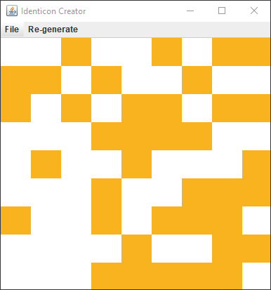

# Identicon-Creator
A Java project that creates randomly generated "identicons," similar to the avatars generated by GitHub. This program also allows the user to save their generated identicons, to use as their profile pictures.

